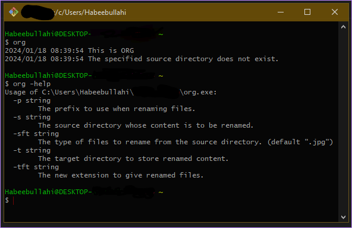

# Directory Organizer

This is a Command Line Program that renames a set of files in a directory.


_Before Organising_


_After Organising_

## Flags

TODO: Add photo


- -s: Source. The source directory whose content is to be renamed. The only required flag.
- -t: Target. The target directory to store renamed content. Defaults to a directory named `renamed` within the source directory. If the specified directory does not exist, it will be created.
- -sft: Source File Type. The type of files to rename from the source directory. Defaults to `.jpg`. When specifying this flag, the `.`must be added at the beginning.
- -tft: Target File Type. The new extension to give renamed files. Defaults to the value of `sft`.
- -p: Prefix. The prefix to use when renaming files.

## Usage

After compiling the source file, the path to the binary should be added to the system's environment variable.
Open a terminal window and type `org` then hit `Enter`. The message `This is ORG` followed by `The specified source directory does not exist.` should be displayed. This shows that the program is ready to be used.

### Renaming files

The program can be used to rename a group of files in a directory.

```bash
org -s="source/directory/" -t="target/directory"
```

If the target directory is not specified, the renamed files will be stored in a directory named `renamed` within the source directory.

### Changing file extensions

The program can change file extensions. By using the `tft` flag you can specify the new extension to use for renamed files.

The example below changes all the `jpg` files in the source directory to `mp4` files in the target directory.

```bash
org -s="source/directory/" -t="target/directory" -tft=".mp4"
```

_Do what you will with this information._

### Adding prefixes

When using the program, renamed files are given numbers as names, to ensure uniqueness of each file name. A prefix can be added to each renamed file to provide another layer of organization. So instead of having files with just `1`, `2`, and so on as names, the files can be `graduation 1`, `graduation 2`, etc.

```bash
org -s="source/directory/" -t="target/directory" -p="graduation"
```
